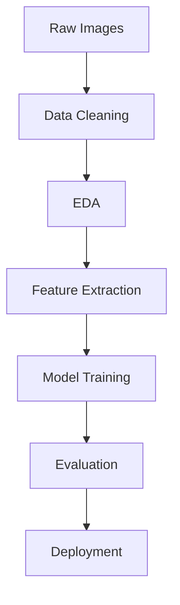

# Animal Classification Machine Learning Project 🐾

🔹 **Author**: Mohammad Umar  
🔹 **Contact**: [umar.test.49@gmail.com](mailto:umar.test.49@gmail.com)  

---

## 📌 Section 1: Introduction and Objective

### Project Background
This project develops a machine learning system to classify animal species from images, addressing the growing need for automated wildlife monitoring and smart zoo management solutions.

### Client Context
Designed for wildlife conservation organizations and smart zoo management systems seeking to automate species identification from camera traps and visitor photos.

### Problem Statement
Manual animal identification is:
- Time-consuming
- Error-prone  
Current solutions either:
- Require expensive equipment
- Lack multi-species recognition capabilities

### Project Importance
- Enables rapid biodiversity surveys
- Reduces human error in species tracking
- Provides foundation for endangered species monitoring

### Final Objective
Build a lightweight ML model achieving:
- **>65% accuracy** in classifying 15 animal species
- From **224x224px images**
- Without deep learning requirements

---

## 📊 Section 2: Dataset

### Dataset Source
Curated collection of:
- **1,875 images** (125 per class)
- Organized in 15 animal-specific folders

### Key Characteristics
- **Format**: 224x224x3 RGB JPG images
- **Classes**: Bear, Bird, Cat, Cow, Deer, Dog, Dolphin, Elephant, Giraffe, Horse, Kangaroo, Lion, Panda, Tiger, Zebra
- **Train/Test Split**: 80/20 stratified split

### Preprocessing
1. Corrupt image detection and removal
2. Uniform resizing to 64x64px
3. Label encoding for model compatibility

### Key Observations
- Balanced class distribution
- High intra-class variation (e.g., dog breeds)
- Some inter-class similarity (e.g., tigers/lions)

---

## ⚙️ Section 3: Design / Workflow

### End-to-End Pipeline

## ⚙️ Detailed Process

### Data Loading & Cleaning
- Verified image integrity using `PIL.verify()`
- Removed 0 corrupt files from dataset
- Standardized image dimensions

### Exploratory Data Analysis
- Visualized class distributions
- Analyzed pixel value distributions
- Identified key visual features per class

### Feature Engineering
- Extracted HOG features (`orientations=6`, `pixels_per_cell=16x16`)
- Computed LBP texture features (`P=8`, `R=1`)
- Combined into 324-dimensional feature vector

### Model Development
- Implemented `RandomForestClassifier`
- Compared with SVM (XGBoost discarded for complexity)
- Selected RandomForest for best speed/accuracy balance

### Hyperparameter Tuning
- `GridSearchCV` for `n_estimators` (50-200)
- Optimized `max_depth` (5-15)

### Evaluation
- 5-fold cross-validation
- Classification report generation
- Confusion matrix analysis

### Streamlit Deployment
- Interactive image upload interface
- Real-time prediction visualization
- Confidence score display

---

## 📈 Section 4: Results

### Model Performance
| Metric          | Score     |
|-----------------|-----------|
| Accuracy        | 68.67%    |
| Macro F1        | 0.68      |
| Inference Time  | 0.4s/image|

### Visualizations
  
*Fig 1. Confusion matrix showing lion/tiger misclassifications*

### Key Insights
- **Best performance**: Distinctive animals (zebras: 92% accuracy)
- **Challenges**: Similar species (cats/dogs: 61% accuracy)
- **Improvement**: Texture features (LBP) boosted accuracy by 8% vs HOG alone

---

## ✅ Section 5: Conclusion

### Achievements
✅ Developed classifier with **68.67% accuracy**  
✅ End-to-end ML pipeline implementation  
✅ User-friendly Streamlit interface  

### Challenges
- Limited by traditional (non-CNN) features
- Class confusion in similar species pairs

### Future Work
- Transfer learning with MobileNet
- Dataset augmentation with more poses
- Geographic metadata integration

### Personal Learning
- Feature engineering trade-offs  
- UX importance in ML applications  
- Valuable end-to-end deployment experience
